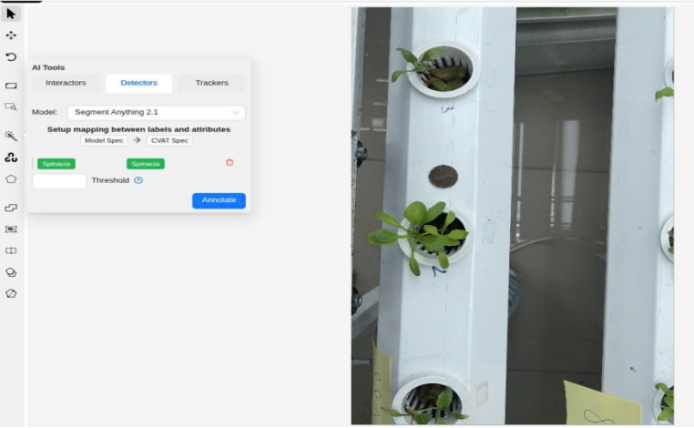
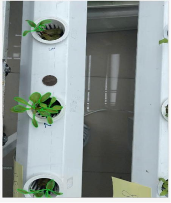

# Leaf_SAM2

## Phương pháp 
Quy trình xử lý bao gồm :
1. Dùng YOLOv8 detect bounding box của từng cây rau trong ảnh lớn.
2. Dùng xử lý ảnh tìm point prompt từ các box.
3. DÙng point prompt để SAM2 tạo mask.
4. Lọc mask hợp lệ và ghép về ảnh gốc.

## Triển khai 
1. Cài đặt CVAT :
https://github.com/cvat-ai/cvat

2. Triển khai model :

    Copy [sam2/nuclio](https://github.com/hungtran1210/Leaf_SAM2/tree/main/Leaf_SAM2/sam2/nuclio) vào phần serverless của CVAT

    Chạy model bằng lệnh ./serverless/deploy_cpu.sh ./serverless/sam2

## Notebooks demo

1. Minh họa phương pháp : [leaf](https://github.com/hungtran1210/Leaf_SAM2/blob/main/Leaf_SAM2/Leaf.ipynb)

2. Train yolo : [yolov8](https://github.com/hungtran1210/Leaf_SAM2/blob/main/Leaf_SAM2/Yolo8.ipynb)

3. Kết quả : [test](https://github.com/hungtran1210/Leaf_SAM2/blob/main/Leaf_SAM2/test.ipynb)

## Hình ảnh minh họa 

