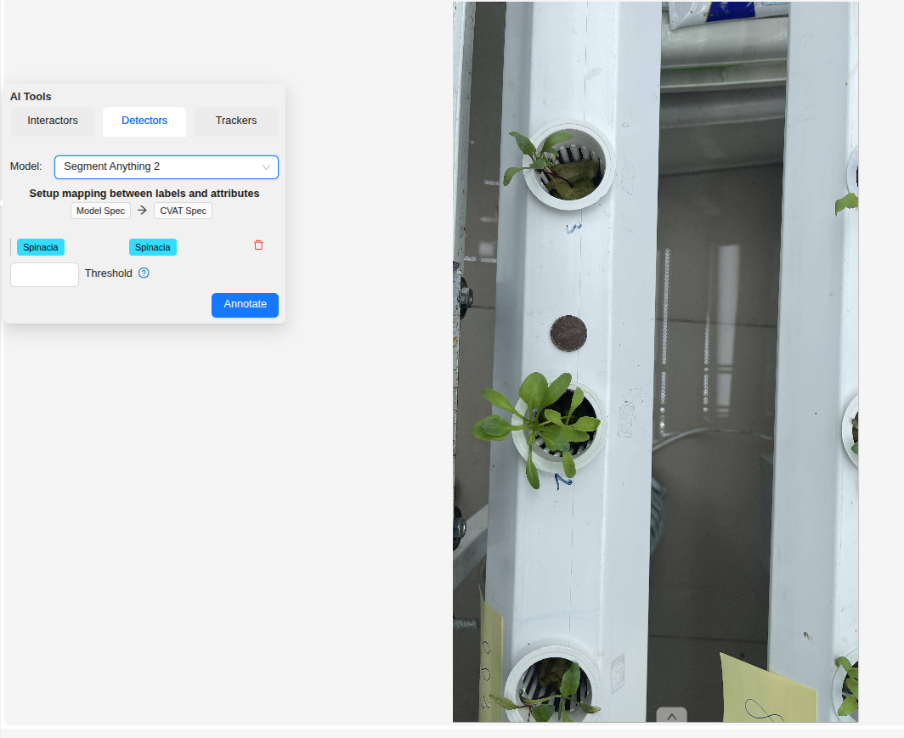
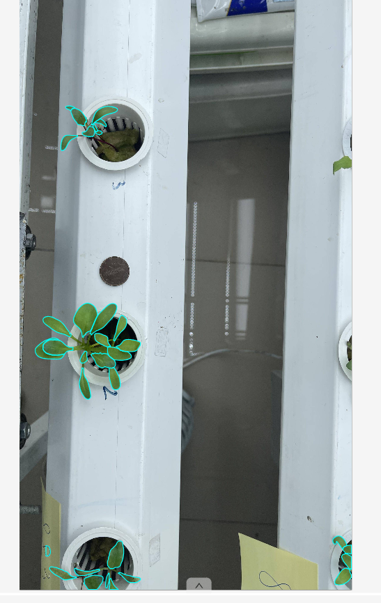

# Leaf_SAM2

## Quy trình xử lý
1. **Phát hiện cây** : Dùng Yolo1 phát hiện crop chứa cây rau trong ảnh.
2. **Phát hiện lá** : Dùng Yolo2 phát hiện box chứa lá cây trong cây rau.
3. **Phân đoạn** : Lấy box và tâm của box làm prompt cho SAM2 tạo masks
4. **Hậu xủ lý** : Lọc mask hợp lệ, làm sạch và ghép về ảnh gốc

*Yolo1 : mô hình yolo11n phát hiện cây rau trong ảnh

*Yolo2 : mô hình yolo11n phát hiện lá rau trong 1 cây 

## Triển khai 
1. Cài đặt CVAT :

    Làm theo hướng dẫn của cvat :

    - [doc cvat](https://docs.cvat.ai/docs/getting_started/)

    - [github cvat](https://github.com/cvat-ai/cvat)

2. Triển khai model :

    Copy [sam2/nuclio](https://github.com/hungtran1210/Leaf_SAM2/tree/main/Leaf_SAM2/sam2/nuclio) vào phần [serverless](https://docs.cvat.ai/docs/getting_started) của CVAT

    Chạy model bằng lệnh :

    ```bash
    docker compose -f docker-compose.yml -f components/serverless/docker-compose.serverless.yml up -d
    ```

    ```bash
    ./serverless/deploy_cpu.sh serverless/sam2
    ```

## Notebooks demo

1. Minh họa phương pháp : [Leaf](https://github.com/hungtran1210/Leaf_SAM2/blob/main/Leaf_SAM2/Leaf.ipynb)

2. Train yolo : [Yolo11](https://github.com/hungtran1210/Leaf_SAM2/blob/main/Leaf_SAM2/Yolo11.ipynb), [Data](https://drive.google.com/drive/folders/1B_m5oU3yYRJjc7jnCyMX2h_7MrT6lsIv?usp=drive_link), [Data_leaf](https://drive.google.com/drive/folders/1H9VW21gfvMESuRjuQ8j7Z4iDanRXGBPR?usp=drive_link) 

3. Kết quả : [Test](https://github.com/hungtran1210/Leaf_SAM2/blob/main/Leaf_SAM2/test.ipynb)

## Hình ảnh minh họa 

